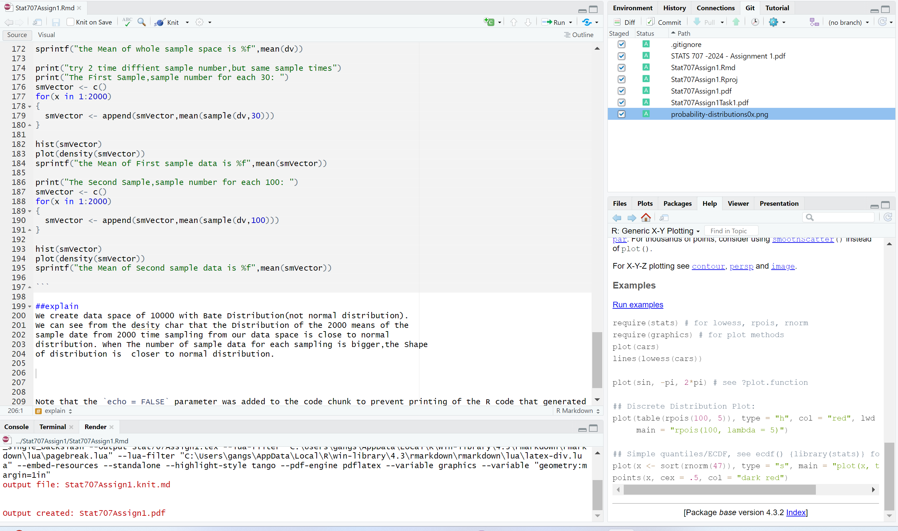

```{r setup, include=FALSE}
knitr::opts_chunk$set(echo = TRUE)
```

## R Markdown

This is an R Markdown document. Markdown is a simple formatting syntax for authoring HTML, PDF, and MS Word documents. For more details on using R Markdown see <http://rmarkdown.rstudio.com>.

When you click the **Knit** button a document will be generated that includes both content as well as the output of any embedded R code chunks within the document. You can embed an R code chunk like this:


##**Task 1:**##

About 30% of human twins are identical and rest are fraternal. Identical twins are necessarily the same sex – half are males and half are females. One-quarter of fraternal twins are both male, one-quarter are both female and one-half are mixed: one male, one female. You have just become parent of twins and are told they are both girls. Given this information, what is the probability that they are identical?


**Answer:** 


Define:

A: twin Identical 

A-:TWin Fraternal 

B:All Female

C:All Male

D: Mixed


**Then**


  p(A)    = 30%
  
  P(A-)   =70%
  
  P(B|A)  = 50%
  
  P(C|A)  = 50%
  
  P(D|A)  = 0%
  
  P(B|A-) = 25%
  
  P(C|A-) = 25%
  
  P(D|A-) = 50%
  

**Thus**


  P(B)=P(B|A)P(A)+P(B|A-)P(A-)
      = 50% * 30% + 25% * 70%
      =32.5%
      
  
  P(A|B)=P(B|A)*P(A)/P(B)
        =50%*30%/32.5%
        =46.15%


```{r,echo=TRUE}
  PFemale=0.5 * 0.3 + 0.25 * 0.7
  PIDenGivFemale=0.5*0.3/PFemale
  
  sprintf('The Answer is %f%s ',PIDenGivFemale*100,'%')
  
  
```


##**TASK2**##


A coin is said to be unbiased if P(heads) = P(tails) = 0.5. Probability that a newly minted coin by a Government Mint is unbiased is 0.95. When an unbiased coin is tossed 100 times, the probability of getting 62 heads or more is 0.01 (0.01048 rounded off to two decimals) for an unbiased coin. As part of a quality control process at the Mint some of the newly minted coins are randomly selected and each coin is tossed 100 times. If a coin tosses heads 62 times or more, it is set aside as a possibly biased (faulty) coin. All such coins are to be melted down and re-minted, which has additional costs. A consultant has been hired to identify efficiencies in this process and see if the criteria of 62 heads or more could possibly be further optimized. Since you work as a data scientist, the consultant asks you to calculate the probability that the coin is unbiased given that it tossed 62 or more heads out of 100 tosses. Find this probability. Assume (just for this example) that a biased coin always has a P(heads) =0.55.
Clearly define your events, state the formulae you are using and show your working.


**Answer:**


Define:

   A: unbiased Mint Coin
   
   A-: biased Mint Coin
   
   B: get Head in ALL TYPES of COINS
   
   B-: get Tail in  ALL TYPES of COINS
   
   C: Get62Head in ALL TYPES of COINS
   
   

Then:

  p(A)=95%
  
  P(A-)=5%
  
  P(B|A)=50%
  
  P(B|A-)=55%
  
  P(C|A)=0.01048
  
Thus:
  P(B)=P(B|A)P(A)+P(B|A-)*P(A-)
  
  P(C) is binomial distribution of probability P(B),there is the formular:
  
  
```{r,echo=TRUE}

  knitr::include_graphics("C:\\R_source\\Stat707Assign1\\probability-distributions0x.png")

  
  p_B=0.5*0.95+0.55*0.05 
  "The Probability get Head in All TYPES OF COINS P(B) is "
  p_B
  
  
  p_C = pbinom(62,100,p_B)
  'The Probability get 62 head in 100 tries from all TYPES OF coins P(C) is '
  p_C
  
  
  'What we need is P(A|C)=P(C|A)P(A)/P(C): '
  PUnbiasGiven62= 0.01048*0.95/p_C

  sprintf("The Answer  is %f%s ",PUnbiasGiven62*100,"%")
    
```


##**TASK3**

  
Question 2: 
This question is about the Central Limit Theorem (CLT). Task 2 is to be implemented using R programming.
Task 1:
Explain in your own words what the CLT states. Explain also, the significance of it in practice.


**Answer:**


No matter what  the distribution of the whole sample space is, if we take random samples(larger than 30) from the sample space,and we repeat the sampling process in n times, the mean of sample(n) are normally distributed.

According the Theorem,We can use Sample data to evaluate the whole sample space.


##**TASK4**


Task 2:
Choose a non-normal probability distribution. Illustrate how CLT holds true as sample size increases by simulating repeatedly from this distribution of your choosing. Make sure to report the following.
a. State the exact distribution (including the exact parameter values) that you have chosen and plot its probability distribution. 

b. State the expected value (i.e. population mean) of this probability distribution.

c. Use histogram and the summary statistic to illustrate that CLT works. Make sure that you clearly label each output so that we know exactly what you are reporting. Accompany a brief but clear explanation as to why you think that your output illustrates that the CLT works. 

```{r,echo=TRUE}

'Answer a: Generate the Beta Distribution Sample Space include 10000 number,and α=100,  β=5'

dv <- rbeta(10000,100,5)

'The Sampe space generated from the Beta Distribution,the Probability Density ploted:'
plot(density(dv))


'Answer b: Expected Value of this distribution is '


print(summary(dv))
sprintf("the SD of whole sample space is %f",sd(dv))


boxplot(dv)

hist(dv)


'Answer C:'

print("try 2 time diffient sample number,but same sample times")
print("The First Sample,sample number for each 30: ")
smVector <- c()
for(x in 1:2000)
{
  smVector <- append(smVector,mean(sample(dv,30)))
}

print(summary(smVector))

boxplot(smVector)

hist(smVector)
plot(density(smVector))
sprintf("the Mean of First sample data is %f",mean(smVector))
sprintf("the SD of First sample data is %f",sd(smVector))

print("The Second Sample,sample number for each 100: ")
smVector <- c()
for(x in 1:2000)
{
  smVector <- append(smVector,mean(sample(dv,100)))
}
print(summary(smVector))

boxplot(smVector)

hist(smVector)
plot(density(smVector))
sprintf("the Mean of Second sample data is %f",mean(smVector))
sprintf("the SD of Second sample data is %f",sd(smVector))

```

##explain
We create data space of 10000 with Bate Distribution(not normal distribution).
We can see from the desity char that the Distribution of the 2000 means of the
sample date from 2000 time sampling from our data space is close to normal 
distribution. When The number of sample data for each sampling is bigger,the Shape
of distribution is  closer to normal distribution.





Note that the `echo = FALSE` parameter was added to the code chunk to prevent printing of the R code that generated the plot.


